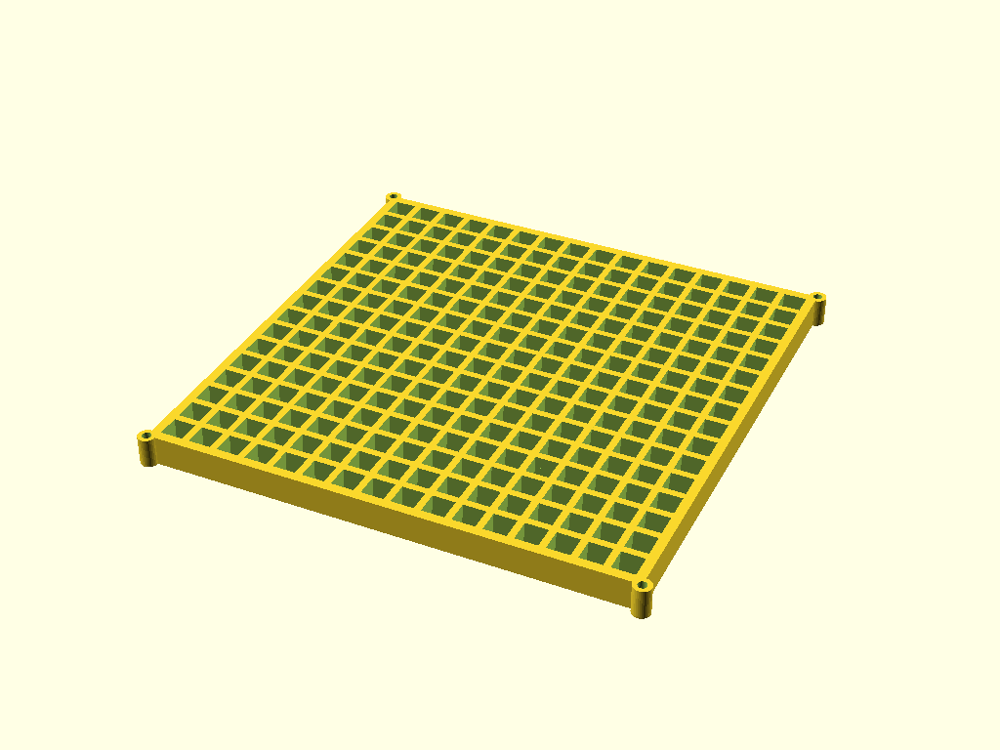
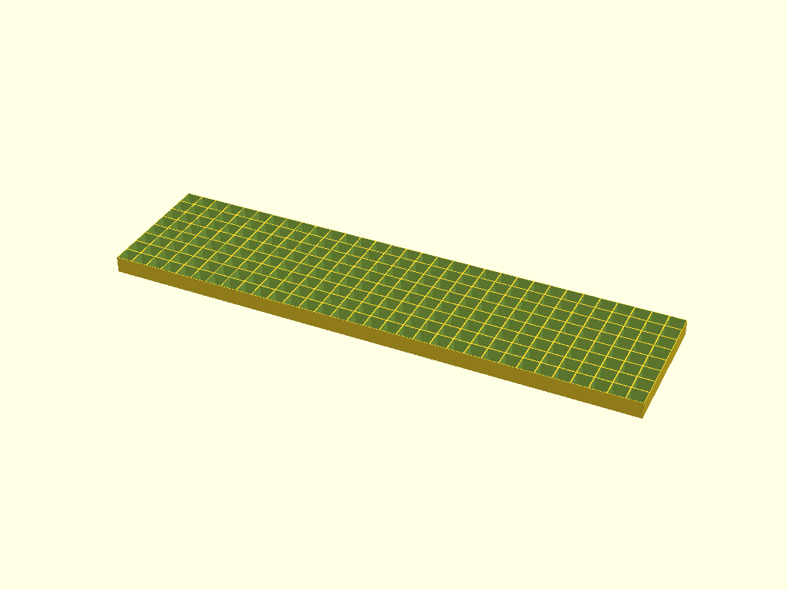
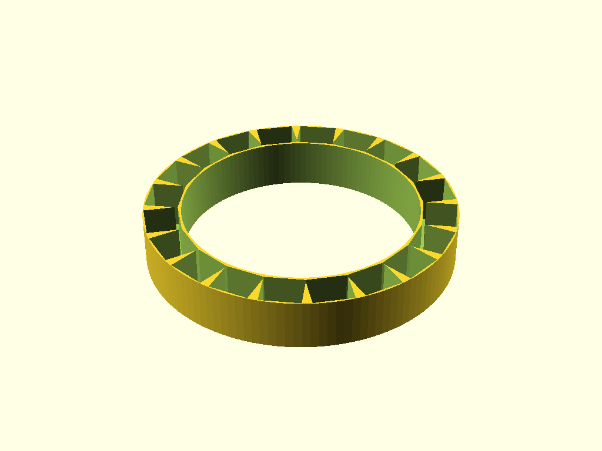

# NeoPixel Diffuser Generator

A parametric OpenSCAD generator for 3D-printable NeoPixel diffuser attachments.

## Target Configurations

### 16x16 Matrix (160x160mm)
- **Dimensions:** 160x160mm
- **LED Pitch:** 10mm
- **Layout:** 16 rows, 16 columns



### 8x32 Matrix (80x320mm)
- **Dimensions:** 80x320mm
- **LED Pitch:** 10mm
- **Layout:** 8 rows, 32 columns



### 20-LED NeoPixel Ring (62mm OD)
- **Outer Diameter:** 62mm
- **Inner Diameter:** 47mm
- **LED Count:** 20



## Usage

### Prerequisites
- OpenSCAD
- Python 3 (for automated generation)
- Xvfb (for headless rendering on Linux)

### Generating Files
To generate all STL and PNG files, run:
```bash
python3 scripts/generate_stl.py
```

To generate a specific panel:
```bash
python3 scripts/generate_stl.py --panel 16x16
```

## Customization
The OpenSCAD script `src/diffuser.scad` provides several parameters for customization:

| Parameter | Default | Description |
|-----------|---------|-------------|
| `type` | `"matrix"` | Layout type: `"matrix"` or `"ring"`. |
| `led_pitch` | `10` | Center-to-center distance between LEDs (mm). |
| `tolerance` | `0.1` | Offset for fit (mm). |
| `wall_thickness` | `0.8` | Width of the dividing walls (mm). |
| `diffusion_height` | `10` | Distance from LED to diffuser top (mm). |
| `bottom_thickness` | `0.4` | Thickness of the top diffusion layer (mm). |
| `cell_shape` | `"square"` | Cavity shape: `"square"` or `"circular"`. |
| `frame_enabled` | `false` | If `true`, adds a reinforced outer frame. |
| `frame_width` | `2.0` | Thickness of the outer frame (mm). |
| `rows` | `16` | Number of rows (matrix only). |
| `cols` | `16` | Number of columns (matrix only). |
| `num_leds` | `20` | Number of LEDs (ring only). |
| `outer_diameter` | `62` | Outer diameter of the ring (mm). |
| `inner_diameter` | `47` | Inner diameter of the ring (mm). |
